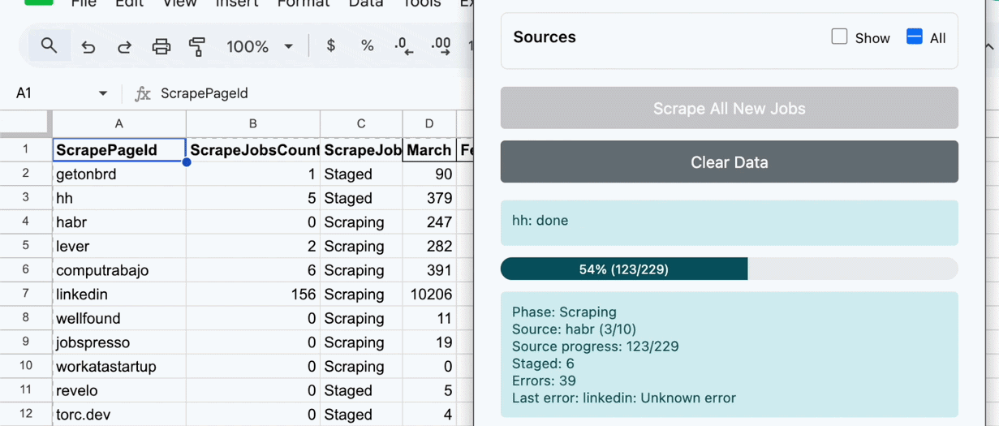
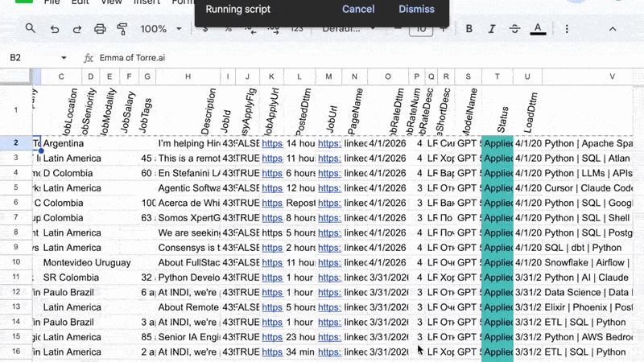
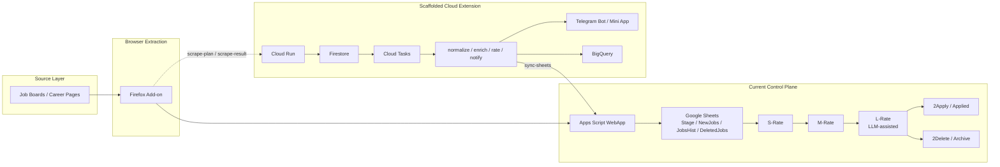

# get-your-offer: Job Intelligence and AI-Scoring Platform

**get-your-offer** is an end-to-end AI-assisted job intelligence pipeline engineered to turn noisy job boards into a structured, scalable data workflow.

This project implements the core competencies from my CV: **end-to-end ETL design**, **LLM orchestration**, **strict Data Quality**, **event-driven patterns**, and a **legacy-to-cloud migration path**.

This repository is the public one-commit showcase snapshot of the product **get-your-offer**.

## Tech Stack


**Scaffolded cloud extension (planned rollout):** `Cloud Run`, `Firestore`, `Cloud Tasks`, `BigQuery`, `Telegram Bot / Mini App`

## Business Impact

| Before | After | Impact |
| --- | --- | --- |
| Fragmented manual review across multiple job boards | Centralized multi-stage job intelligence pipeline | Unified control plane for extraction, scoring, and application tracking |
| High triage overhead | Leaner staged screening workflow | **90% lower operational overhead** |
| Lower application throughput | Higher-signal application pipeline | **3x higher application throughput** |

**Verified outcome (March 2026):** `11,636 scraped -> 1,486 after final L-Rate -> 493 targeted applications -> 12 HR responses -> 8 interviews -> 2 test tasks`

**Engineering discipline:** developed with saved HTML fixtures, modular adapters, formal contracts, operational docs, and a conservative cloud rollout strategy.

## What it does

### 1. Collects Jobs

<p align="center">
  
</p>

- Extracts vacancies from source-specific scrapers across job boards and career pages
- Normalizes list and detail payloads into a unified job schema before any downstream processing
- Loads rows into a single operational control plane instead of scattered browser tabs and notes

### 2. Evaluates Jobs

<p align="center">
  
</p>

- Applies schema validation, deduplication, and staged routing before deeper review
- Runs `S-Rate -> M-Rate -> L-Rate`, including LLM-assisted extraction and fit scoring
- Converts a raw market feed into prioritized, higher-signal vacancies

### 3. Builds Prioritized Application Queue

- Produces a prioritized next-action queue after staged scoring and filtering
- Stores apply URLs, statuses, priorities, and operator fields in the same control plane
- Turns raw vacancy volume into an operator-friendly application workflow

### Extra

- Registers applications and funnel transitions in the same operational dataset
- Supports autofill in repetitive application flows
- Preserves lineage from scraped row to rated row to applied row

## Architecture



The current system of record is still the **Apps Script + Google Sheets control plane**. The cloud layer is scaffolded for planner, async workers, bot flows, and analytics without pretending that the repo already proves a full production rollout.

Failure boundaries are explicit: source-specific breakage stays in the Firefox Add-on layer, staged row state stays in Sheets, and async orchestration is isolated behind the planned Cloud Run / Firestore / Cloud Tasks path.

## Why it exists

The job market behaves like a fragmented operational data source:

- source sites expose inconsistent schemas and changing HTML contracts
- duplicates and reposts inflate noise
- manual triage does not scale
- high-signal opportunities can disappear inside high-volume feeds
- application tracking often gets detached from the original source record

get-your-offer applies **Data Lakehouse-style normalization** and **event-driven stage processing** to job market intelligence. Instead of reviewing boards one by one, the pipeline extracts, validates, deduplicates, scores, and routes vacancies through a single control plane.

The same adapter-first architecture is designed to stay portable across unstable and geo-specific job boards, including local Uruguay and broader LATAM market sources.

## Engineering Depth

- **Schema validation and source contracts:** list and detail scrapers feed a shared job shape before rows enter the pipeline
- **Deduplication and incremental load:** `JobId` and `JobUrl` checks prevent noisy re-ingest and keep stage-to-history movement deterministic
- **Lineage and audit logging:** `Stage`, `NewJobs`, `JobsHist`, `DeletedJobs`, `LoadsLog`, and `ScrapeLog` keep row history observable
- **LLM orchestration (LangChain + OpenAI):** 3-stage fit scoring (`S-Rate -> M-Rate -> L-Rate`) with structured output, parallel worker execution, and cost/reliability controls
- **Retry, fallback, and recovery:** LRate orchestration includes retry/fallback behavior and session recovery for up to **99.9% extraction reliability**
- **Parallel worker thinking:** staged scoring and planned async workers move the system toward DAG-like orchestration instead of one-off manual review

### Reliability Behind 99.9%

- **LLM calls use configurable retry policy:** retry attempts, sleep interval, exponential backoff, and model fallback are part of the Apps Script rating flow
- **Unstable SPA sources degrade gracefully:** list/detail messaging can retry with short backoff, and SPA sources can use `reload + retry` before final fail
- **LRate writes are fail-closed:** rows are leased with stable identity and snapshot checks, chat slots recover or rotate, and incomplete responses are rejected instead of silently corrupting state
- **Operational failures stay visible:** `ScrapeLog`, `LoadsLog`, Telegram send errors, row status transitions, shell-page detection, random jitter, and conservative tab caps make scraping failures observable instead of silent

## Operational Snapshot (March 2026)

| Stage | Count |
| --- | ---: |
| Scraped vacancies | 11,636 |
| After final L-Rate | 1,486 |
| Applications | 493 |
| HR responses | 12 |
| Interviews | 8 |
| Test tasks | 2 |

**Result (March 2026):** the pipeline reduced `11,636` raw vacancies to `493` targeted applications that generated `12` HR responses, `8` interviews, and `2` test tasks.

## 🚀 Quick Start

### 1. Build and load the Firefox Add-on

```bash
cd firefox-addon
npm install
npm run build
```

Then open `about:debugging` in Firefox, choose `This Firefox`, click `Load Temporary Add-on`, and select `firefox-addon/dist/hrscrape2mart.xpi`.

### 2. Configure the Sheets control plane

- Deploy the Apps Script project as a Web App
- In Google Sheets `Settings`, set `WebAppUrl` to the deployed Apps Script URL
- Fill `ScrapeList` with source list pages
- Keep the `Stage`, `NewJobs`, `JobsHist`, and `DeletedJobs` tabs as the operational control plane

### 3. Run the first local flow

- Open the target Google Sheet
- Start scraping from the add-on popup
- Validate `Stage`, then run `Increment Load`
- Continue through `S-Rate`, `M-Rate`, and `L-Rate` until jobs reach `2Apply` or `2Delete`

### 4. Optional cloud smoke

The cloud extension is documented separately in [DEPLOY_GCP.md](docs/DEPLOY_GCP.md).

Local smoke scripts already exist in `cloud/`:

```bash
cd cloud
npm install
npm run typecheck
npm run build
npm run smoke:e2e
npm run smoke:bot
```

## ⚙️ Technical Challenges & Trade-offs

- **Why Google Sheets first:** Sheets acted as a low-friction operator control plane with visible row state, fast manual review, and immediate auditability before a full database-backed workflow was justified
- **Why staged scoring instead of one-shot LLM prompts:** cheap deterministic filters remove obvious noise early, while later LLM stages spend tokens only on higher-value candidates
- **How unstable job boards were handled:** source-specific contracts, retry/backoff, reload+retry for brittle SPAs, random jitter, shell-page detection, and per-source tab caps reduce scraper fragility
- **How Apps Script constraints shaped the design:** quotas and request latency pushed the system toward incremental loads, status-based routing, lease-based updates, and fail-closed row writes
- **Why cloud migration is incremental:** Sheets is still the operator-facing source of truth, while Cloud Run, Firestore, and Cloud Tasks are being introduced as orchestration layers instead of via a risky hard cutover

## Core Components

- **Firefox Add-on extraction layer:** source-specific scrapers for list and detail pages with a shared interface
- **Apps Script ingest and routing:** schema validation, duplicate filtering, incremental load, and stage promotion into operational sheets
- **Google Sheets as control plane:** a Single Source of Truth for row status, manual review, funnel tracking, and audit-friendly operations
- **Multi-stage scoring pipeline:** rules plus LLM-assisted evaluation across `S-Rate`, `M-Rate`, and `L-Rate`
- **Reliability patterns:** retry/fallback orchestration, session recovery, and staged worker logic for long-running extraction
- **Planned cloud extension:** Cloud Run, Firestore, Cloud Tasks, BigQuery, and Telegram flows scaffolded for event-driven orchestration

## Repository Layout

- `appsscript/` Apps Script sources
- `firefox-addon/` Firefox addon code and build scripts
- `cloud/` Cloud backend and worker services
- `fixtures/` saved HTML fixtures for scraper development
- `infra/` infrastructure and deployment config
- `docs/` architecture, contracts, settings, and debugging notes

## What this project demonstrates

- **Strict data quality and lineage** built around a Single Source of Truth
- **Production-grade LLM orchestration (LangChain + OpenAI)** with 3-stage scoring, structured output, cost controls, and `99.9%` reliability
- **Retry/fallback orchestration and session recovery** for up to `99.9%` extraction reliability
- **Parallel worker orchestration** comparable to dynamic DAG-style processing
- **Planned migration to Cloud Run, Firestore, Cloud Tasks, and BigQuery** as a modern data stack extension

## Status / Roadmap

- [x] Hybrid local control plane: Firefox Add-on -> Apps Script WebApp -> Google Sheets
- [x] Scaffolded cloud extension: Cloud Run routes, Firestore adapter, Cloud Tasks, Telegram flows, BigQuery, and Terraform rollout guardrails
- [ ] Validate the first real Cloud Run deployment and smoke `/health`, `/internal/sync-source-configs`, and `/miniapp`
- [ ] Expand per-vacancy async workers and harden sync-source-configs plus Mini App operational flows
- [ ] Replace fake local Telegram session bootstrap with real webhook/auth flow and extend cloud analytics usage

This roadmap aligns with the same **Data Lakehouse** and **event-driven architecture** principles I apply in enterprise data engineering work.

## Contact / Open to Roles

📬 Open to **Senior/Lead Data Engineer** roles focused on scalable ETL, LLM orchestration, and event-driven architectures.

**Contact:** `kirill.nickolsky@gmail.com` | **Telegram:** `@g1n000`
